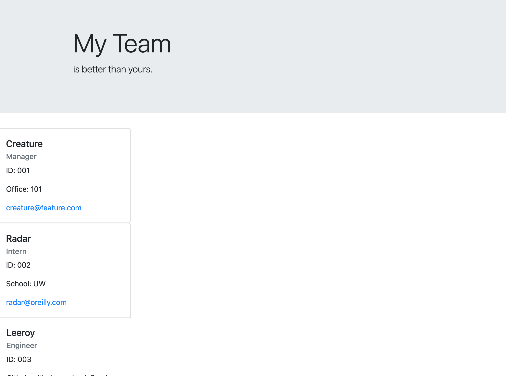

  # TEAM CARD GENERATOR 

  ## TABLE OF CONTENTS
  * [Description](#description)
  * [Installation](#installation)
  * [Usage](#usage)
  * [Tests](#tests)
  * [FAQ](#faq)

  ## DESCRIPTION
  Create a HTML of your office members with this appliciation. Members will be displayed in cards with the relevant information presented below. As of this release, you can only create one manager, interns, and engineers.
  App Walkthrough: https://drive.google.com/file/d/1PWcS9cUHBleZSsGffiRMCsKM2OW1ejUy/view?usp=sharing

  ## INSTALLATION
 Before running this apllication, make sure to install Jest, Inquirer, and Node.

  ## TESTS
  To run the incorporated tests, type 'npm test' in your command-line.

  ## USAGE
  

  ## FAQ
  * shadin.alarab@gmail.com
  * https://github.com/shadin-a
  * Feel free to reach me via my carrier pigeon, Hank.

  # LICENSE
  
  Licensed by https://opensource.org/licenses/MIT
  
  
